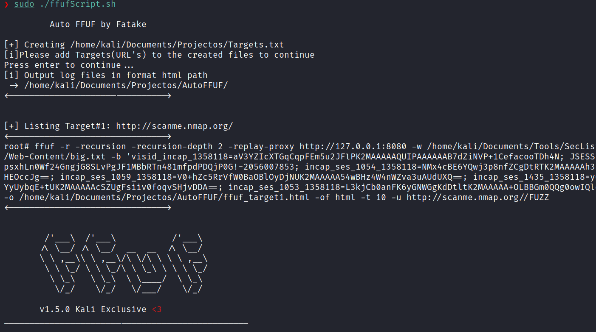

# Auto ffuf

Script to run a trustfull ffuf web directorie listing of targets



---

## Usage

Clone github

```
git clone https://github.com/Fatake/autoffuf.git
```

**Run script**

```
sudo ./autoffuf.sh
```

Note:
After running the command make sure to add targets (url) to the Targets.txt file
